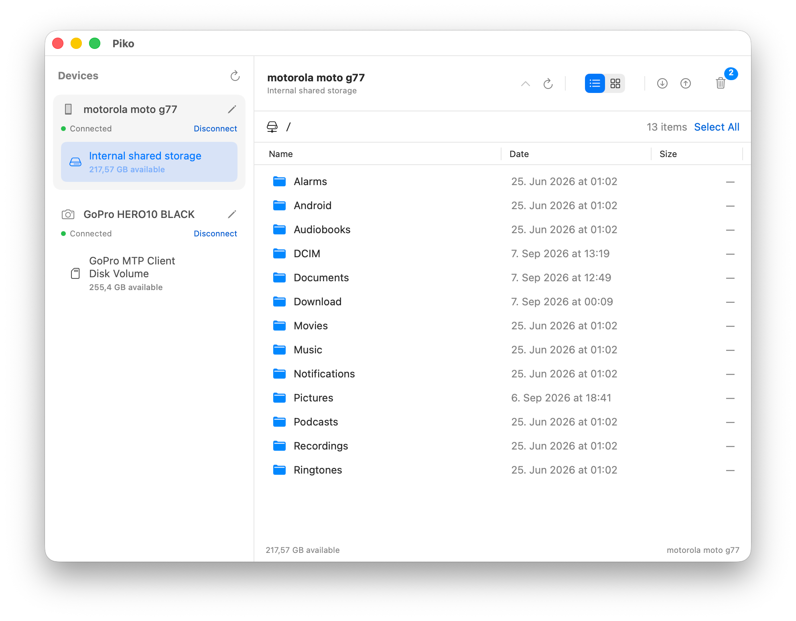

# Piko

Fast, fully native macOS file transfers for Android phones, cameras, and other
USB MTP devices. Drag and drop files, free up space, and manage several devices
from one window.

**Apple Silicon · macOS 14 or newer**

## What you can do

- **Drag and drop** files and folders between your Mac and connected devices.
- **Organize files** by moving them between folders on the same storage.
- **Transfer between devices** by dragging to another device or storage. Files
  are copied, keeping the originals safe.
- **Free up space** with file deletion, a recoverable bin, and permanent deletion
  when you're ready.
- **Browse photos and videos** with thumbnail previews in a list or image grid.
- **Work with several devices** at once, each with its own transfers.

Available actions depend on your device. Existing files are never overwritten.

## Download

**[Download Piko for macOS — Apple Silicon](https://github.com/morishuz/piko/releases/download/v0.15.4/Piko-macOS-arm64.zip)**

[All releases](https://github.com/morishuz/piko/releases) · [SHA-256](https://github.com/morishuz/piko/releases/download/v0.15.4/Piko-macOS-arm64.zip.sha256)

This preview is not yet Developer ID signed or notarized.
See the **[short user guide](docs/USER_GUIDE.md)** for installation, first-launch
approval, safe deletion, and diagnostics.

## Getting started

Connect your device with a USB data cable, unlock it, and choose **File Transfer**
on the device if prompted. Click **Connect** in Piko, then start browsing or dragging
files. Close other apps that are using the same device.

## Private by default

Piko makes **no internet connections** and records **no diagnostic logs** unless
you explicitly enable them in Settings. Logs stay on your Mac; including filenames
requires separate consent. You choose whether to export, share, or delete them.

## More

[Build from source](CONTRIBUTING.md) · [MIT license](LICENSE) ·
[Third-party acknowledgments](THIRD_PARTY_NOTICES.md)
